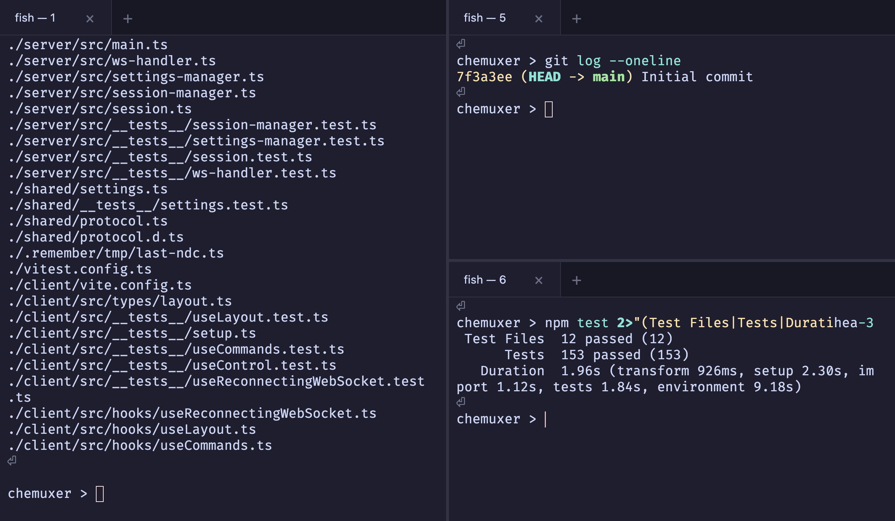
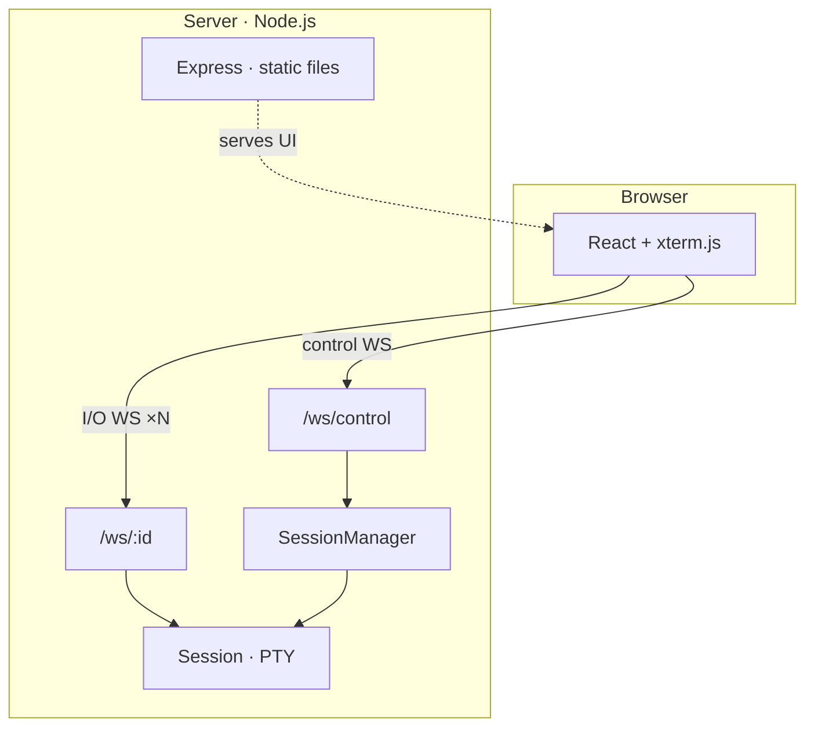

# Chemuxer

**/tʃɛˈmʌksər/** — "Che" as in Eclipse **Che**, "muxer" as in multi**plexer**.

A web-based terminal multiplexer built with TypeScript, React, and xterm.js. Split panes, tabs, drag-and-drop, command palette, and persistent shell sessions — all in the browser.



## Features

- **Split panes** — drag tabs to edges for VS Code-style splits, resize with draggable separators
- **Tabs** — per-pane tab bars with drag-and-drop between panes
- **Command palette** — Cmd+Shift+P / F1 for quick access to all commands
- **Session persistence** — shell sessions survive browser disconnects; terminal state (including TUI apps) restores on reconnect
- **Auto-reconnect** — exponential backoff with disconnect banner and countdown
- **Layout persistence** — split layout survives browser refresh (via localStorage)
- **Pane zoom** — Cmd+Shift+M to maximize a pane, toggle back to restore layout
- **Settings** — Monaco-based JSON editor with schema validation, live reload
- **Themes** — Catppuccin Mocha (dark) and Latte (light), switchable via settings or palette
- **Context menu** — right-click tabs for rename, close, and split actions

## Quick Start

```bash
npm install
npm run dev
```

Open http://localhost:5173 in your browser.

### Prerequisites

- Node.js 22+
- A C++ compiler toolchain for `node-pty` native addon (Xcode CLT on macOS, `build-essential` on Linux)

## Architecture

Single Node.js process: Express serves the React frontend and a WebSocket server manages terminal sessions via `node-pty`.



- **Control WebSocket** (`/ws/control`) — session lifecycle, settings sync, rename events
- **I/O WebSockets** (`/ws/:sessionId`) — binary terminal data per session
- **Headless xterm.js** — server-side virtual terminal for state serialization on reconnect

See [Architecture Decision Records](docs/adr/README.md) for detailed design rationale.

## Scripts

| Command | Description |
|---------|-------------|
| `npm run dev` | Start dev server (backend + Vite frontend) |
| `npm run build` | Build for production |
| `npm start` | Run production build |
| `npm test` | Run all tests |
| `npm run test:watch` | Run tests in watch mode |

## Docker

```bash
docker build -t chemuxer .
docker run -p 7681:7681 chemuxer
```

## Configuration

Settings are stored in `./config/settings.json` and editable via the built-in Monaco editor (Cmd+Shift+P → Open Settings).

```json
{
  "terminal": {
    "fontFamily": "'JetBrains Mono', monospace",
    "fontSize": 14,
    "theme": "catppuccin-mocha"
  },
  "shell": {
    "path": ""
  },
  "scrollback": {
    "lines": 5000
  }
}
```

## Keyboard Shortcuts

| Shortcut | Action |
|----------|--------|
| Cmd+Shift+P / F1 | Command palette |
| Cmd+Shift+M | Toggle pane zoom |

## Tech Stack

- **Frontend:** React 19, xterm.js 6.x, react-resizable-panels, cmdk, Monaco
- **Backend:** Node.js, Express 5, ws, node-pty
- **Shared:** TypeScript end-to-end, shared WebSocket protocol types
- **Testing:** Vitest (153 tests), Testing Library
- **Build:** Vite (frontend), tsc (backend)

## MCP Server

An optional namespace-level MCP server lets AI agents (Claude Code, Cursor, etc.) manage terminal sessions across workspaces via the [Model Context Protocol](https://modelcontextprotocol.io). See [`packages/chemuxer-mcp/`](packages/chemuxer-mcp/README.md) for setup and tool reference.

## Contributing

See [CONTRIBUTING.md](CONTRIBUTING.md).

## License

[Eclipse Public License 2.0](LICENSE)
